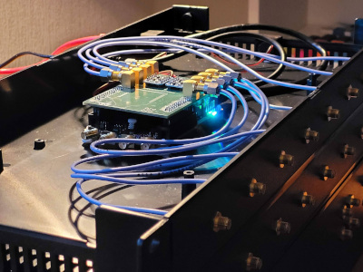
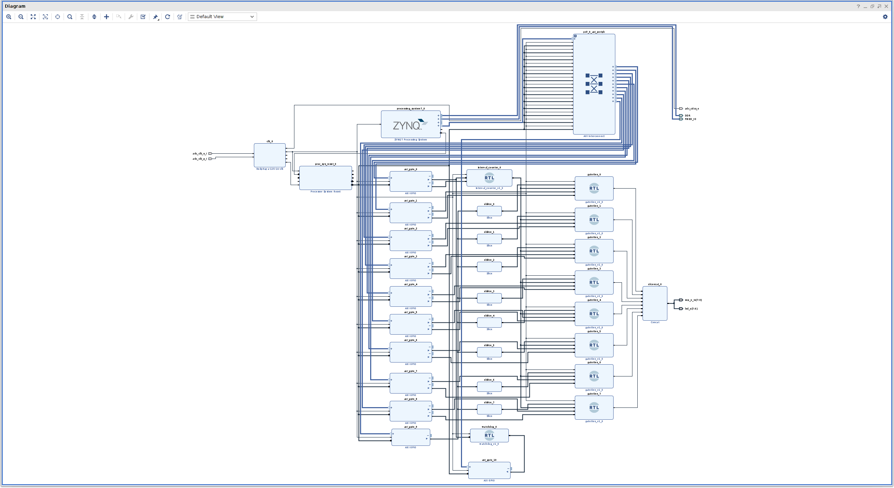
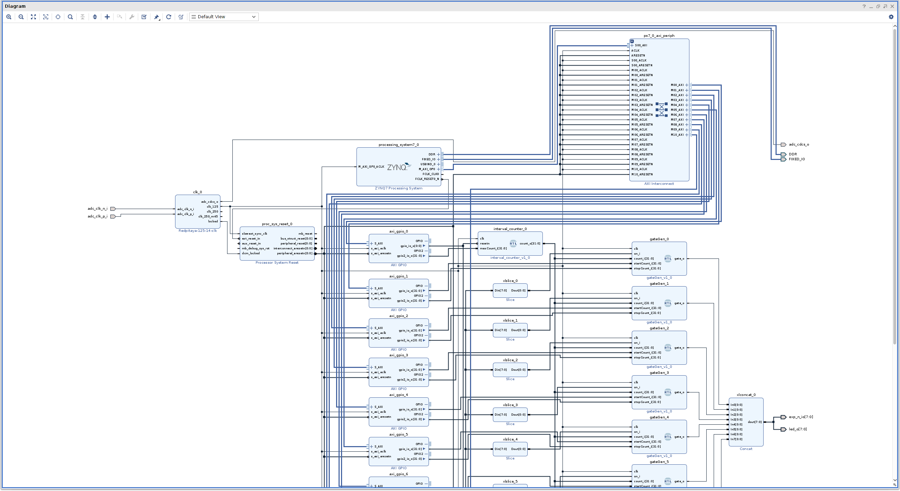
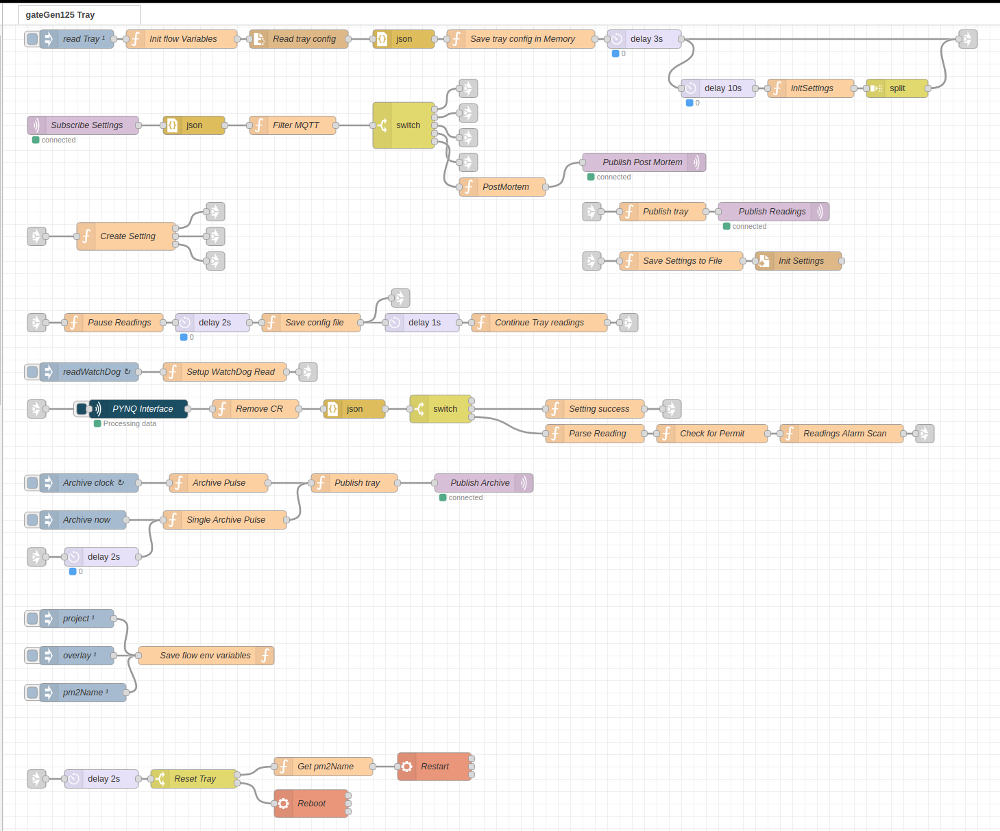

# Timing Gate Generator
* gateGen125-tray <a href="https://github.com/bl-mirrotron/gateGen125-tray" target="_blank">source code</a>
* [Timing System Overview](https://bl-mirrotron.github.io/#timing-system)

The Timing Gate Generator uses a <a href="https://redpitaya.com/product-category/stemlab-125-14/" target="_blank">Red Pitaya Stemlab 125-14</a> to generate 8 timing channels system based on a 32 bit counter clocked at 125 MHz. The resolution of the timing system is 8nS and can have intervals as long as 17 seconds. The output of the gate generator uses the <a href="https://bl-mirrotron.github.io/mirrotron-rfq-llrf-timer-cube" target="_blank">RFQ LLRF Timer Cube</a> circuit as shown in Figure 1.

The FPGA code for the Gate Generator was developed with the <a href="https://www.xilinx.com/support/download/index.html/content/xilinx/en/downloadNav/vivado-design-tools/archive.html" target="_blank">Vivado 2020.2 HLS</a> design edition following the  <a href="https://github.com/dspsandbox/FPGA-Notes-for-Scientists" target="_blank">FPGA Notes for Scientists</a> tutorials. the overall Vivado Design view is shown in Figure 2 and a closeup of the gate design is shown in Figure 3. The design requires three custom real-time-logic (RTL) blocks
* <a href="doc/interval_counter.vhd.txt" target="_blank">Interval counter</a> The maximum count value of the interval counter determines the length of the gate generator interval.
* <a href="doc/gateGen.vhd.txt" target="_blank">Gate generator</a> The start and stop counts of the gate generator determine the start time with respect to the interval counter and the length of the pulse.
* <a href="doc/watchdog.vhd.txt" target="_blank">Watchdog counter</a> is used to verify that the gate generator is working properly and all communication links are operating.

Since the Red Pitaya Stemlab 125-14 is a Linux computer, a Blinky-LiteTM tray can be directly installed on the Red Pitaya Stemlab 125-14. The tray code is written in the <a href="https://nodered.org/" target="_blank">Node-RED</a> programming environment as shown in Figure 4. The tray flow is a modified version of the standard  Blinky-LiteTM tray for serial communications. The GPIO bus of the Red-Pitay can be easily addressed with the <a href="http://www.pynq.io/" target="_blank">PYNQ</a> Python interface. A Python script using PYNQ was <a href="https://github.com/bl-mirrotron/gateGen125-tray/blob/master/zynqInterface.py" target="_blank">developed</a>. The script is accessed though a <a href="https://flows.nodered.org/node/node-red-contrib-pythonshell" target="_blank">pythonshell</a> node labeled PYNQ Interface in dark blue as shown in Figure 4.

Figure 1.  Gate Generator Implementation

 

Figure 2.  Vivado Design view

 

Figure 3.  Vivado Design View Closeup

 

Figure 4.  Gate Generator Blinky-LiteTMTray Node-RED flow

 

